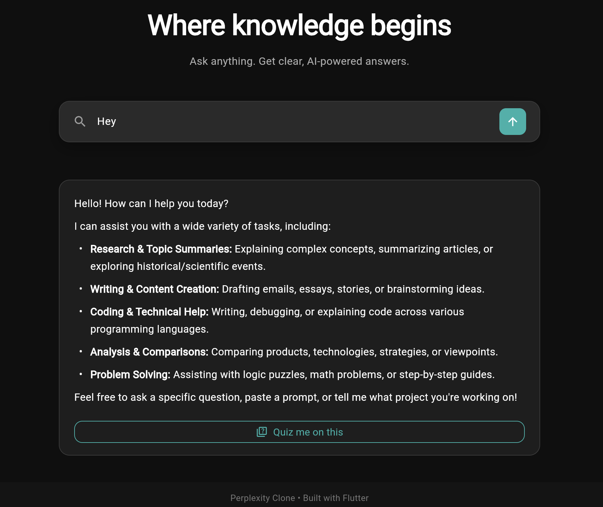
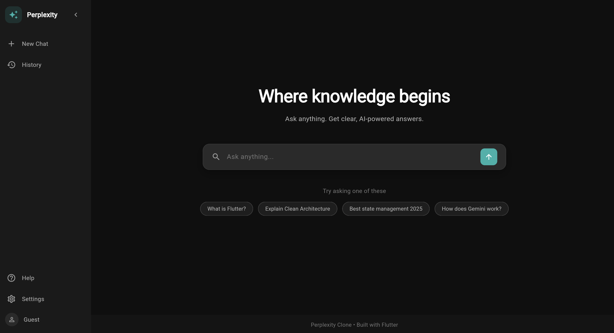
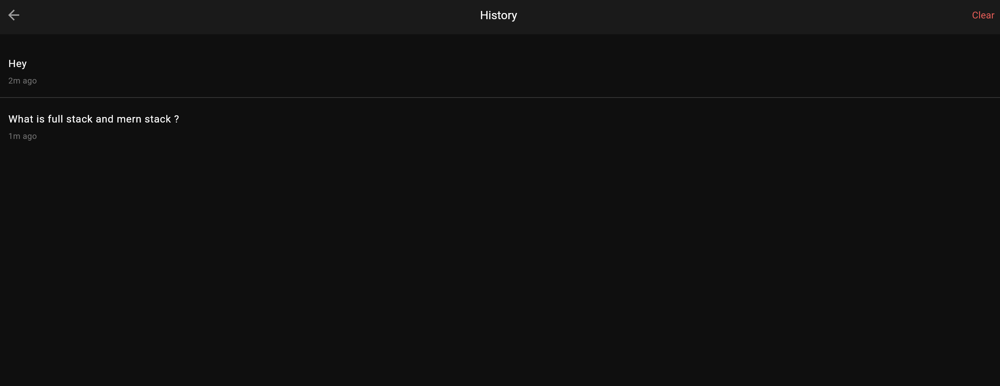
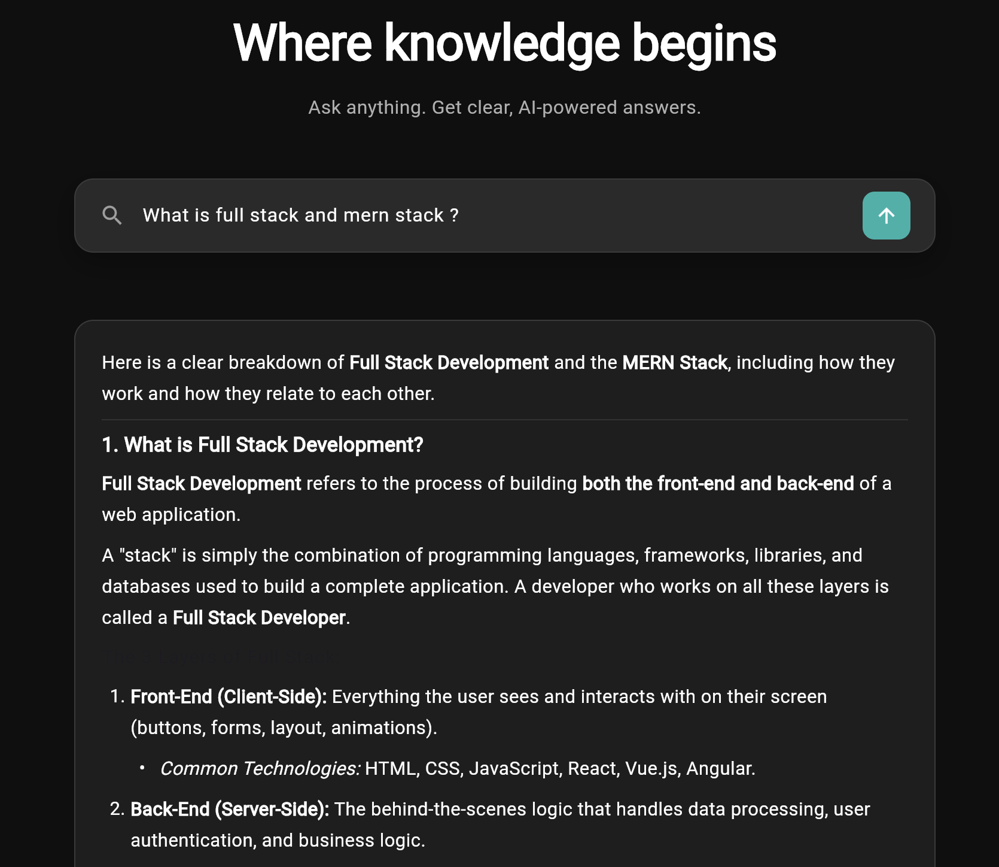
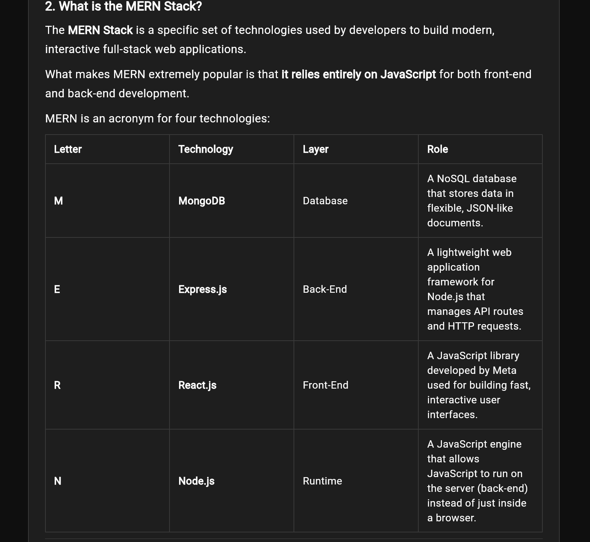

<div align="center">

# ✨ Perplexity Clone

**An AI-powered answer assistant inspired by Perplexity — featuring Markdown-formatted answers, a built-in Quiz Mode, and local search history.**

[](https://flutter.dev)
[](https://dart.dev)
[](https://fastapi.tiangolo.com)
[](https://www.python.org)
[](https://ai.google.dev)

[🚀 Live Demo](https://ai-search-assistant-six.vercel.app/) · [📦 GitHub Repository](https://github.com/techAsmita/AI-Search-Assistant)

</div>

---

## 📖 Overview

**Perplexity Clone** is a full-stack AI search assistant that lets users ask questions and receive clear, well-structured answers powered by **Google Gemini**. The frontend is built with **Flutter Web** for a responsive, cross-platform UI, while a **FastAPI** backend handles AI requests and quiz generation. It also includes a Quiz Mode that turns any answer into a set of multiple-choice questions, along with locally stored search history for quick access to past queries.

---

## 🔑 Key Features

- 🤖 **AI-powered question answering** using Google Gemini
- 📝 **Markdown-formatted answers** for clean, readable responses
- 🧠 **Quiz Mode** — auto-generates multiple-choice questions from any answer
- 🕘 **Local history** of previous searches for quick recall
- 📱 **Responsive, collapsible sidebar** for a smooth experience across screen sizes
- ⏳ **Loading and error states** for reliable, user-friendly feedback
- ✅ **Input validation** to prevent invalid or empty queries
- 💡 **Suggested prompts** to help users get started quickly

---

## 🛠️ Tech Stack

| Layer | Technology |
|---|---|
| Frontend | Flutter Web (Dart) |
| Backend | FastAPI (Python) |
| AI Engine | Google Gemini API |
| Frontend Hosting | Vercel |
| Backend Hosting | Render |

---

## 🏗️ Architecture

```
Flutter Web  →  FastAPI Backend  →  Google Gemini API
```

The Flutter Web app sends user queries to the FastAPI backend over HTTP. The backend forwards each request to the Google Gemini API, processes the response (including formatting answers and generating quiz questions), and returns structured JSON back to the Flutter frontend for rendering. The Gemini API key is kept securely on the backend as an environment variable and is never exposed to the client.

---

## 📸 Screenshots

| | |
|---|---|
| **Greeting Screen**<br> | **Hero Section**<br> |
| **Search History**<br> | **Search Results**<br> |

**Search — Markdown Answer**


---

## 📁 Project Structure

```
AI-Search-Assistant/
├── backend/
│   ├── main.py            # FastAPI app: chat & quiz-generation endpoints
│   ├── requirements.txt   # Backend Python dependencies
│   └── runtime.txt        # Python runtime version for deployment
├── lib/
│   ├── main.dart           # App entry point
│   ├── config.dart         # App configuration (e.g. API base URL)
│   ├── models/
│   │   └── quiz_models.dart
│   ├── pages/
│   │   ├── home_page.dart
│   │   ├── history_page.dart
│   │   └── quiz_page.dart
│   ├── services/
│   │   ├── api_service.dart
│   │   └── history_service.dart
│   ├── theme/
│   │   └── colors.dart
│   └── widgets/
│       └── side_bar.dart
├── screenshots/            # App screenshots used in this README
├── web/                     # Flutter web build assets
├── pubspec.yaml             # Flutter project dependencies
└── README.md
```

---

## ⚙️ Local Setup

### 1. Clone the repository
```bash
git clone https://github.com/techAsmita/AI-Search-Assistant.git
cd AI-Search-Assistant
```

### 2. Set up the Flutter frontend
```bash
flutter pub get
flutter run -d chrome
```

### 3. Set up the FastAPI backend
```bash
cd backend
python -m venv venv
source venv/bin/activate   # On Windows: venv\Scripts\activate
pip install -r requirements.txt
```

### 4. Configure environment variables
Create a `backend/.env` file and add your Gemini API key:
```env
GEMINI_API_KEY=your_api_key_here
```

### 5. Run the backend server
```bash
uvicorn main:app --reload
```

---

## 🔐 Environment Variables

The backend requires a single environment variable, defined in `backend/.env`:

```env
GEMINI_API_KEY=your_api_key_here
```

> ⚠️ The `.env` file must **never** be committed to version control.

---

## ☁️ Deployment

- **Frontend** is deployed on **[Vercel](https://ai-search-assistant-six.vercel.app/)**, serving the compiled Flutter Web build.
- **Backend** is deployed on **[Render](https://ai-search-assistant-upzl.onrender.com)**, running the FastAPI application.
- The deployed Flutter frontend communicates with the deployed FastAPI backend over HTTPS to send queries and receive AI-generated responses.

---

## 🚧 Future Improvements

- Add user authentication and cloud-synced history
- Support voice input for queries
- Add citation/source display alongside answers
- Introduce dark/light theme toggle
- Improve quiz difficulty customization